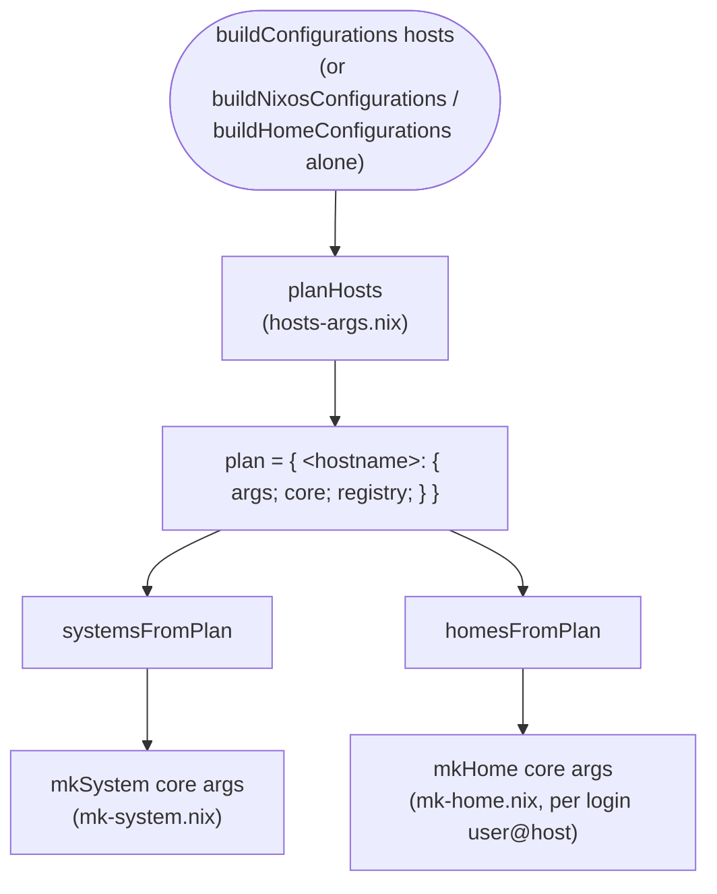

# Architecture

Contributor notes: how the repository is laid out and how a hosts
attrset becomes systems and homes. Consumers should read
[getting-started.md](getting-started.md) instead; this page is for
working ON the library.

## File layout

```
lib/
  default.nix       the loader: names every public file, assembles the
                    lib as a fixed point. The `namespacePaths` list IS
                    the public surface -- dropping a file into a folder
                    publishes nothing until it is named there (checked
                    against the on-disk tree by the exports test).
  attrsets/         small helpers (recursiveMerge, ...)
  strings/          small helpers (stringToTitle, ...)
  imports/          importIfNix / importIfNixOr, readIfPlain /
                    readIfPlainOr (git-crypt-friendly)
  disko/            declareZfsRootDisk (+ operational README.md)
  nixos/            the builders -- what this repo is about
    build-configurations.nix        buildConfigurations
    build-nixos-configurations.nix  buildNixosConfigurations
    build-home-configurations.nix   buildHomeConfigurations
    mk-nixos-system.nix             mkNixosSystem (public face)
    mk-home-configuration.nix       mkHomeConfiguration (public face)
    home-manager-bootstrap-module.nix  the login bootstrap module
    normal-user-module.nix          default per-user account module
    scripts/                        the bootstrap shell script
    internal/         PRIVATE: never listed in the loader, reachable
                      only by direct import
      shared.nix      thin aggregator the builder files import
      hosts-args.nix  argument allowlists, hosts-attrset validation,
                      planHosts, and the plan's two projections into
                      builder output (systemsFromPlan / homesFromPlan)
      context.nix     mkContextCore / mkContext -- the expensive
                      `import nixpkgs` lives here
      inputs.nix      input conventions and inputContributions
      registry.nix    userRegistry resolution and validation
      mk-system.nix   mkSystem (the mkNixosSystem implementation)
      mk-home.nix     mkHome (the mkHomeConfiguration implementation)
      ext-options.nix the nixpkgsLibExtensions.* options module
      module-level.nix  the module-level/flake-level lib split
      bootstrap-script.nix  wiring for scripts/
checks/             eval-time tests (builders/tests/*.nix), VM tests,
                    fixtures, and the example that doubles as the
                    flake template
docs/lib.md         GENERATED from doc comments (scripts/gen-docs.sh);
                    `nix run .#gen-docs` rebuilds it, a check diffs it
```

Every file under `lib/` takes one calling convention,
`{ lib, self, ... }`: nixpkgs' `lib`, and `self` -- the fully
assembled extension lib (a fixed point), so a file can call a sibling
without importing it.

## From a hosts attrset to systems and homes



`planHosts` does three things:

1. `splitHostsArgs`: validate every key against the allowlists,
   split off `_defaults` and `_groups`; ALL complaints are collected
   and thrown together.
2. merge per host: `_defaults`, then the host's `_groups` layer
   (selected by `effectiveGroup`), then the host entry; the host's
   `extra` slot ADDS on top (lists concatenate, attrsets merge).
3. core sharing: hosts are grouped into equivalence classes over the
   CORE arguments (`coreArgNames` -- derived from `mkContextCore`'s
   formals, never hand-listed); ONE `mkContextCore` per class.

`systemsFromPlan` calls `mkSystem core args` per host: it builds the
context (`mkContext core`: lib, pkgs, specialArgs, collected modules)
and picks one of two evaluation routes -- route A,
`nixpkgs.lib.nixosSystem`, for an unpatched nixpkgs flake; route B,
`eval-config` imported from the selected tree, for a patched tree or a
nixpkgs input exposing no `lib.nixosSystem` -- a check pins both
routes to the same derivation. `homesFromPlan` calls `mkHome core args`
per login-managed `user@host`, sharing the same `mkContext` core and
producing a `homeManagerConfiguration`.

The direct builders (`mkNixosSystem`, `mkHomeConfiguration`) validate
their arguments and call the same `mkSystem`/`mkHome` with
`core = null`, meaning "compute your own" -- only a plan ever passes a
prebuilt core, which is how a fleet shares one nixpkgs evaluation.

`mkContextCore` (context.nix) is the host-INDEPENDENT part: the
package set, the extended lib, and everything auto-collected from the
inputs (inputs.nix decides what each input contributes and how
`inputContributions` narrows it). `mkContext` adds the thin per-host
layer: specialArgs, plus the guard that throws if a host's own
`specialArgs` redefines a name the builder already owns (`hostname`,
`tags`, `pkgs`, ...). The builder-derived per-host values reach
modules as the `nixpkgsLibExtensions.*` options (ext-options.nix),
imported into every system and every home.

## Things that are enforced, not remembered

- `nix fmt` / `nix run .#gen-docs` -- the formatting and
  docs-up-to-date checks run the exact same scripts.
- The loader's path list, the core-argument list, the `coreDefaults`
  table (context.nix's default value for each CORE argument --
  `patches`, `overlays`, `nixpkgsConfig`, ...), the argument allowlist
  and its documentation bullets, and the guide's options table are all
  pinned by eval-time assertions in
  checks/builders/tests/ -- each one is a pair of things that used to
  be able to drift apart.
