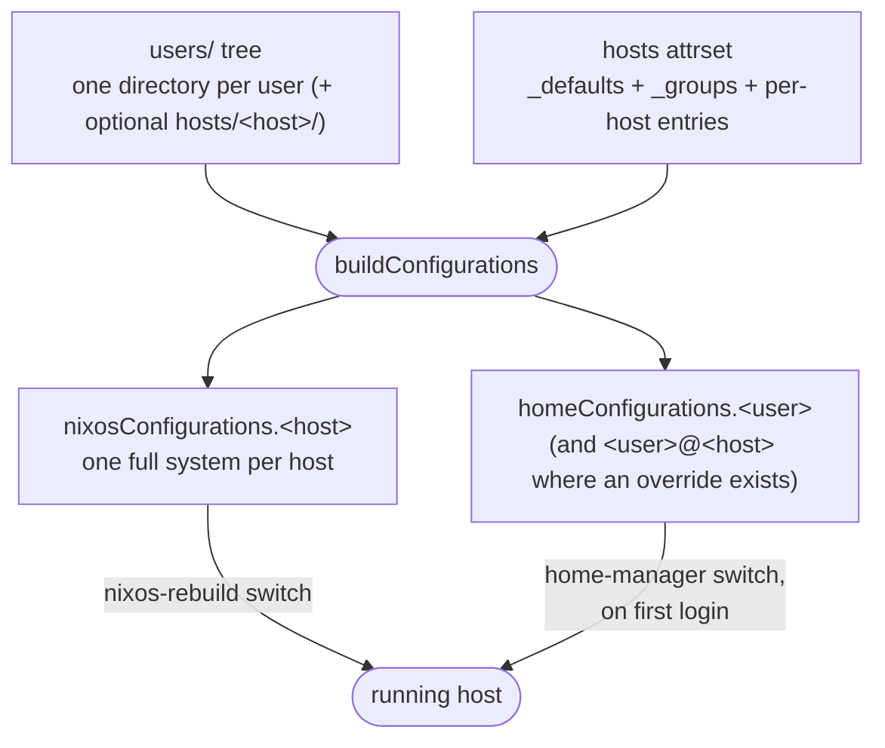
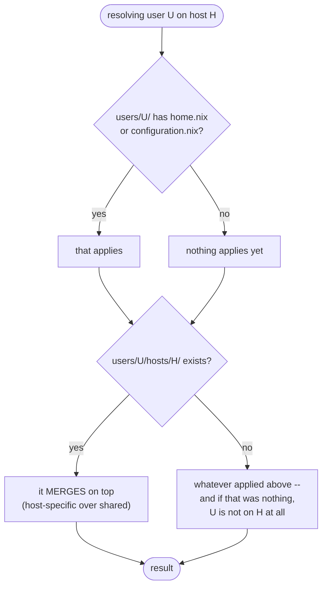
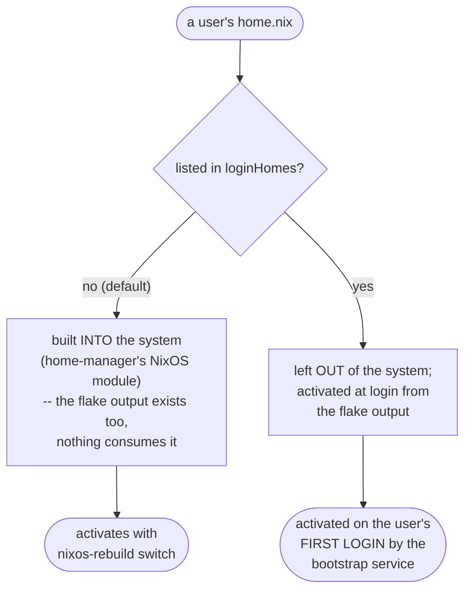

# Getting started with the NixOS / home-manager builders

This guide takes you from nothing to a NixOS host with provisioned
users, using the builders from this repo. The API reference for every
function lives in [lib.md](lib.md); this document explains the concepts
and the workflow.

## What you get

- A **`users/` directory tree** declares your users: one directory per
  user holds their home config, their system-level config (groups,
  account settings), and any per-host overrides.
- Each **host** is one attrset entry; its machine config is found by
  file convention.
- Login accounts are **created automatically**, each with a private
  primary group.
- Each user's home is activated by ONE of two mechanisms, chosen per
  user: **with the system** (default -- home-manager's NixOS module,
  applied by `nixos-rebuild switch`) or **on first login** (users
  listed in `loginHomes` -- a systemd user service runs
  `home-manager switch` in the background).
- NixOS modules, home-manager modules, overlays and lib extensions
  exported by your flake inputs are **wired in automatically**.

The pieces above, at a glance:



## Quick start

Everything here is flakes-based, so Nix must have the `nix-command`
and `flakes` experimental features enabled (e.g.
`experimental-features = nix-command flakes` in your `nix.conf`).

Scaffold a working setup into an empty directory:

```
nix flake init -t github:dvaerum/nixpkgs-lib-extensions
git init && git add .
```

(`git add` matters: files a flake cannot see do not exist. A new
`home.nix` that was never `git add`ed is skipped silently.)

You now have:

```
flake.nix              two hosts; users come from users/
hosts/
  laptop.nix           host config, file form
  server/
    configuration.nix  host config, directory form
users/
  alice/               home.nix -- on every host
    home.nix
  dave/                home AND system config
    home.nix
    configuration.nix
  eve/                 system-only user (no home)
    configuration.nix
  frank/               on every host ...
    home.nix
    configuration.nix
    hosts/laptop/      ... plus these extras, merged, on laptop
      configuration.nix
  bob/ carol/ grace/   further shapes, see the users tree
```

**Make it real before building**, in two places:

1. The scaffolded **host files** are placeholders (a fake root
   filesystem, no boot loader). Note that this still *activates* --
   it does not fail safe -- so replace the contents of
   `hosts/laptop.nix` with your machine's actual config first,
   typically an import of its `hardware-configuration.nix` plus a boot
   loader.
2. The scaffolded **users/ tree** creates six real accounts (alice,
   bob, dave, eve, frank, grace) with their groups and, for the
   `loginHomes`, their bootstrap services. Replace those directories
   with your own users before the first switch.

A host file then looks like:

```nix
{ ... }:
{
  imports = [ ./laptop-hardware.nix ];
  boot.loader.systemd-boot.enable = true;
  system.stateVersion = "26.11";
}
```

Then build and activate the host:

```
nixos-rebuild switch --flake .#laptop
```

This builds the system INCLUDING the homes of every user not listed in
`loginHomes` -- those activate right there, with the switch. Users
listed in `loginHomes` are left out of the system and activated on
their first login by the bootstrap service instead.

Independently of that split, a user with a `home.nix` of their own is
also exported as a flake output -- `homeConfigurations."alice"`, plus
`"alice@laptop"` where she has a per-host override for a host this
flake declares (both keys exist when both apply; a user whose ONLY
override is for an undeclared host gets nothing here). For a
`loginHomes` user that output is what the bootstrap applies; for
everyone else it is simply also buildable by hand. Either way you normally never run
`home-manager` yourself.

## The users tree

Users are declared by a **directory tree**, not an attrset. One
directory per user under `users/`, and that is the whole declaration:

```
users/
  alice/
    home.nix             alice's home-manager config, on every host
  dave/
    home.nix
    configuration.nix    NixOS config for dave: groups, account tweaks
  eve/
    configuration.nix    system-only user: an account, no home
  frank/
    home.nix             applies everywhere ...
    configuration.nix
    hosts/
      laptop/
        configuration.nix   ... plus this, MERGED, on `laptop` only
  bob/
    hosts/
      laptop/
        home.nix         bob exists on `laptop` and nowhere else
```

Each directory may contain one or both of:

- `home.nix` -- the user's home-manager configuration
- `configuration.nix` -- NixOS config for that user: extra groups,
  account tweaks, anything system-level

A directory with only `configuration.nix` is a **system-only user**:
account and groups, but no home configuration and no bootstrap.

One rule covers every case:

> A user's directory applies on **every** host. A `hosts/<hostname>/`
> subdirectory applies on **that** host and **merges** on top. A user
> with *only* `hosts/` subdirectories exists on those hosts and nowhere
> else.



That produces two shapes of home output:

| What the user has | Outputs |
|---|---|
| `home.nix` only | `homeConfigurations."alice"` -- one home, usable on any machine |
| `home.nix` + any `hosts/laptop/` override | **both** `"frank"` and `"frank@laptop"` (frank's override is a `configuration.nix`) |
| only `hosts/laptop/home.nix` | `"bob@laptop"` only |
| only `configuration.nix` in `hosts/laptop/` | no home, but an account on `laptop` |
| only `configuration.nix` | no home output (account only) |

Both keys when both exist is deliberate: `"frank"` is the
default-anywhere profile, buildable on a machine the tree has never
heard of, and `"frank@laptop"` is that profile with the laptop
override merged in. Adding one machine-specific override must not
silently remove the ability to `home-manager switch --flake .#frank`
everywhere else.

### Where the tree is read from

`rootPath` (default: your flake, `inputs.self`) -- or `loginFlakeRef`
when the homes live in **another** flake. That second form is what
makes a shared, multi-flake setup work with no per-consumer wiring:

```nix
# home-manager-config/flake.nix -- owns users/dennis, users/root, ...
# the users/ directory IS the declaration; nothing to export

# the consuming NixOS flake
mkNixosSystem {
  loginFlakeRef = inputs.home-manager-config;
  # ...
};
```

Each build announces what it found (silence it with
`traceDiscoveredUsers = false;`):

```
trace: nixpkgs-lib-extensions: buildConfigurations: users discovered in
/nix/store/.../users: dennis, root -- expected? Silence with
`traceDiscoveredUsers = false;`.
```

A `loginFlakeRef` that is a flake-ref **string** (`"/etc/nixos"`, a
mutable checkout -- see [Two home mechanisms](#two-home-mechanisms))
cannot be read at evaluation time, so no users are discovered from it.

### Combining several trees on one host

A single `loginFlakeRef` value (as above) **replaces** `rootPath`'s
tree entirely -- for the common "all my homes live in one other flake"
case. To instead **add** users from one or more trees you do not fully
control alongside your own -- say `dennis` lives in this flake, `per`
lives in one repo, and `bo` in another -- give `loginFlakeRef` a
**list**:

```nix
mkNixosSystem {
  # rootPath's own tree (dennis, here) always applies and is always
  # trusted; loginFlakeRef only decides what gets ADDED to it. Two
  # DIFFERENT sources here -- the same source named twice would make
  # every username in it ambiguous (see the collision throw below).
  loginFlakeRef = [
    inputs.per-flake                                    # untrusted (default)
    { source = inputs.bo-flake; allowNixosConfig = true; }  # explicitly trusted
  ];
};
```

`allowNixosConfig` governs ONE thing: whether that source's
`configuration.nix` files are imported. They run with full,
unrestricted NixOS module authority -- `security.*`, arbitrary
`imports`, anything -- so a repo you don't fully control does not get
that by default. `home.nix` and the account itself are never gated by
it: an untrusted user still gets a real account and their home applies
normally, just not their own `configuration.nix` content. **This
default is `false` everywhere `loginFlakeRef` is used, including a
bare, non-list value** -- a deliberate breaking-change default, since
no trust concept existed before it. The same username discovered in
more than one source throws (ambiguous -- pick one source per user).

This is a separate concern from the login bootstrap: `loginFlakeRef`
as a list only affects account/`configuration.nix`/`home.nix`
discovery for **system-managed** users. The login bootstrap itself
still resolves one shared flake for every `loginHomes` user on a host,
so a list `loginFlakeRef` throws at build time if the host also has a
`loginHomes` user actually needing resolution there (naming someone in
`loginHomes` who has no home on this host does not trigger it) -- keep
multi-tree users system-managed, or use a single value on a host with
login-managed users.

### Selecting which users apply to a host

By default every user in the tree applies to every host. A host's
`users` argument narrows that:

```nix
hosts = {
  laptop = { };                      # every user in the tree
  server = { users = [ ]; };         # none of them
  build  = { users = [ "ci" ]; };    # just this one
};
```

A name that is not in the tree is a typo and throws. This narrows the
host's ACCOUNTS and its `"<user>@<host>"` homes; the host-less
`"<user>"` outputs come from the tree itself and are unaffected --
`server = { users = [ ]; };` still exports a host-less home for every
user in the tree, it just has no `server` account or `"<user>@server"`
override.

## Hosts

Each host is one entry in the hosts attrset you hand to
`buildConfigurations`; the key is the hostname. In your flake the full wiring looks like this (the scaffolded
`flake.nix` has this shape):

```nix
{
  inputs = {
    nixpkgs.url =
      "github:NixOS/nixpkgs/nixos-unstable";
    home-manager = {
      url = "github:nix-community/home-manager";
      inputs.nixpkgs.follows = "nixpkgs";
    };
    nixpkgs-lib-extensions = {
      url = "github:dvaerum/nixpkgs-lib-extensions";
      # avoid locking a second nixpkgs/home-manager
      inputs.nixpkgs.follows = "nixpkgs";
      inputs.home-manager.follows = "home-manager";
    };
  };

  outputs =
    { nixpkgs, nixpkgs-lib-extensions, ... }@inputs:
    let
      extLib = nixpkgs-lib-extensions.lib;
      system = "x86_64-linux";
      pkgs = nixpkgs.legacyPackages.${system};
      # ONE host list for both outputs
      hosts = {
        # shared by every host; a host
        # entry overrides per argument
        _defaults = {
          inherit inputs system;
          # alice's home activates on
          # her first login; all other
          # homes ship with the system
          loginHomes = [ "alice" ];
        };
        laptop = { };
        server = {
          # none of the users/ tree
          # applies to this host
          users = [ ];
        };
      };
    in
    # ONE call, BOTH outputs:
    # nixosConfigurations AND
    # homeConfigurations (see below)
    extLib.buildConfigurations hosts
    // {
      devShells.${system}.default =
        pkgs.mkShell {
          packages = [ pkgs.nixfmt ];
        };
      packages.${system}.default =
        pkgs.hello;
    };
}
```

`buildConfigurations` is the entry point to reach for. The NixOS half
is also available separately as `buildNixosConfigurations` (same hosts
attrset). Exporting only that one is a trap: a `loginHomes` user's home is resolved at their first
login, so a missing `homeConfigurations` output fails *then*, on a
booted machine, rather than at build time. One call cannot forget half.
It is also cheaper: `buildConfigurations` plans the hosts once and takes
both outputs from that one plan, instead of evaluating the shared
host-independent context twice.

`buildHomeConfigurations` is a different shape: it is the entry point
for a **home-manager-only** flake and takes a FLAT argument set, not a
hosts attrset. Having no declared host list, it discovers the host
dimension from the tree alone -- so it also emits a `"<user>@<host>"`
home for any `users/<user>/hosts/<host>/` directory, including hosts
this flake never declares.

`buildConfigurations`'s return value is an ordinary attrset -- `{ nixosConfigurations =
...; homeConfigurations = ...; }`, nothing more -- so it composes with
`//` exactly like hand-written outputs, as in the `devShells`/`packages`
merge above. Nothing about using the builders confines your flake to
only the two outputs they produce.

Later snippets in this guide assume these bindings (`extLib`,
`inputs`, `system`) from this skeleton.

The reserved `_defaults` entry (never a valid hostname -- a hostname
cannot START with `_`) supplies arguments to every host. Merging is
per-argument and the host entry wins entirely, no deep-merging of
lists or attrsets -- see `buildNixosConfigurations`'s doc comment
(`docs/lib.md`) for the full merge rule. For "shared base plus
per-host extras" put the addition in that host's `extra` slot
instead:

```nix
_defaults = { modules = [ ./base.nix ]; homeModules = [ ./direnv.nix ]; };
laptop = {
  extra.modules = [ ./desktop.nix ];   # base.nix AND desktop.nix
  extra.homeModules = [ ./extra.nix ]; # direnv.nix AND extra.nix
  nixpkgsConfig = { cudaSupport = true; };  # replaces outright
};
```

`_defaults` must not set `hostname` or `extra` (it throws).

The host's own configuration is imported by convention, relative to
your flake root:

- `hosts/<hostname>.nix`, or
- `hosts/<hostname>/configuration.nix`

Both existing at once is an error. Anything extra goes in `modules`.

With many machines, group them by kind: set `group = "vm";` on a
host and the lookup moves one folder deeper, to
`hosts/vm/<hostname>.nix` (or `hosts/vm/<hostname>/configuration.nix`).
The value also reaches your modules as
`config.nixpkgsLibExtensions.group`, so shared modules can branch
on it. Without `group` nothing changes -- no extra subfolder is
consulted. When the folder layout should NOT follow the
classification, `hostFolder = "vm";` selects the folder segment on its
own, whatever `group` says.

A group can also carry shared ARGUMENTS: a reserved `_groups.<name>`
entry in the hosts attrset is merged between `_defaults` and every
host declaring `group = "<name>";` -- later layers win per argument,
and a group entry's `extra` slot ADDS to the `_defaults` values just
like a host's does:

```nix
hosts = {
  _defaults = { inherit inputs system; };
  _groups.server = {
    tags = [ "headless" ];
    extra.modules = [ ./common/server.nix ];  # _defaults.modules PLUS this
  };
  web1 = { group = "server"; };
  web2 = { group = "server"; };
  laptop = { };                               # no group, no layer
};
```

When `_groups` is present, a host's `group` must name one of its
entries (a typo throws, listing the declared groups); without
`_groups`, `group` is just the free-form classification.

## Accounts

Every user the tree gives a host gets a login account automatically:
`userModule` defaults to `normalUserModule`, which sets
`isNormalUser` and gives the user a **private primary group** named
after them (instead of the shared `users` group).

System accounts are recognized by uid and left untouched: NixOS
reserves uid 0-999 for system and service accounts (root is 0) and
its module system forbids setting `isNormalUser = true;` on any of
them. So when a user's merged uid falls in that range -- root, or a
user whose `configuration.nix` pins a reserved uid -- this
module contributes nothing: the account keeps whatever group and
shell its own config already gives it. So `"root"` is a valid users-tree
entry: it gets its `home.nix`/`configuration.nix`, never account
changes.

Richer accounts -- build on the default:

```nix
userModule = username: {
  imports = [ (extLib.normalUserModule username) ];
  users.users.${username} = {
    extraGroups = [ "networkmanager" ];
  };
};
```

Disable account creation entirely with `userModule = null;`
(accounts must then come from your host config or the users'
`configuration.nix` files).

## Two home mechanisms

Every user's `home.nix` is activated by exactly one of two
mechanisms; `loginHomes` selects which:



System-managed (the default) means the home is built together with
the system, as one derivation: home-manager's own
`useGlobalPkgs`/`useUserPackages` options are enabled, so home-manager
reuses the system's package evaluation and installed packages instead
of fetching its own -- set with low priority (`mkDefault`), so a host
module can still override them. A broken home config then fails the
whole system build, and no flake outputs are involved. Each home
receives `username` as a module argument and gets `home.stateVersion`
defaulted to the CURRENT nixpkgs release -- but a home actually
relying on that moving default is warned (both mechanisms): pin it
in the user's
`home.nix` (`home.stateVersion = "26.11";`) or fleet-wide via an
entry in the shared `homeModules` argument.

Login-managed exists for homes that should update independently of
system rebuilds. On the user's first login a systemd *user* service
runs

```
home-manager switch --flake <loginFlakeRef>#<user>
```

(or `#<user>@<host>` where that user has a `hosts/<host>/` override --
the bootstrap picks whichever the flake actually exports, decided when
the system is built, not at login)

in the background (login is never blocked). A stamp file in
`$XDG_STATE_HOME` (default `~/.local/state`) prevents re-runs; pass
`loginReactivateEveryLogin = true;` to re-apply on every new session
instead. `loginFlakeRef` defaults to your flake (`inputs.self`) --
the pinned copy from the last `nixos-rebuild`; point it at a mutable
checkout (e.g. `"/etc/nixos"`) if users should build from a live
tree.

A login-managed user can also re-run `switch` manually between
logins: the host gets a detach-safe `home-manager` on
`environment.systemPackages` automatically (`wrapHomeManagerSwitch`,
default `true`). Wrapped, not the bare package, because `switch`'s own
activation restarts every user unit whose store path changed, which
can include the very unit the invoking shell's cgroup lives in
(a tmux server, an SSH session) -- stopping THAT terminates the switch
mid-activation. Set `wrapHomeManagerSwitch = false;` to opt out.

For login users your flake must export a home configuration for every
host where they appear. The bootstrap activates
`<loginFlakeRef>#<user>@X` or `#<user>` -- whichever that flake really
exports, decided when the system is BUILT. A flake that exports
`homeConfigurations` but neither name fails the build, naming the user.
Two cases cannot be introspected and keep the `<user>@<host>` form: a
flake-ref STRING, and a flake exporting no `homeConfigurations` at all.
There a missing output surfaces at first login as "flake ... does not
provide attribute homeConfigurations...". The skeleton above covers it:
`buildConfigurations hosts` produces the homeConfigurations half from
that same host list. (The underlying single-user function is
`mkHomeConfiguration`, if you need one specific home.)

### The bootstrap without the builders

`homeManagerBootstrapModule` is a plain NixOS module and can be used
on its own, for systems built without `mkNixosSystem`.
A complete flake:

```nix
{
  inputs = {
    nixpkgs.url =
      "github:NixOS/nixpkgs/nixos-unstable";
    home-manager = {
      url = "github:nix-community/home-manager";
      inputs.nixpkgs.follows = "nixpkgs";
    };
    nixpkgs-lib-extensions = {
      url =
        "github:dvaerum/nixpkgs-lib-extensions";
      inputs.nixpkgs.follows = "nixpkgs";
      inputs.home-manager.follows =
        "home-manager";
    };
  };

  outputs =
    { nixpkgs, nixpkgs-lib-extensions, ... }@inputs:
    let
      extLib = nixpkgs-lib-extensions.lib;
      system = "x86_64-linux";
      users = {
        alice = ./users/alice;
      };
    in
    {
      # a system built WITHOUT the builders
      nixosConfigurations.laptop =
        nixpkgs.lib.nixosSystem {
          inherit system;
          modules = [
            ./configuration.nix

            # accounts are YOUR job here; the
            # builders would have created them
            {
              users.users.alice = {
                isNormalUser = true;
              };
            }

            # installs the login service
            (extLib.homeManagerBootstrapModule {
              inherit inputs system users;
              hostname = "laptop";
              loginHomes = [ "alice" ];
              # loginReactivateEveryLogin =
              #   true;
              # loginFlakeRef = "/etc/nixos";
            })
          ];
        };

      # the home the bootstrap activates. The module looks for
      # "alice@laptop" first and falls back to "alice", so either name
      # works -- this one omits `hostname`, giving the host-less form.
      homeConfigurations."alice" =
        extLib.mkHomeConfiguration {
          inherit inputs system;
          username = "alice";
        };
    };
}
```

At login the service runs
`home-manager switch --flake <loginFlakeRef>#alice` -- the name it
resolved at build time -- exactly as in the builder setup. Three things the standalone module does NOT do
(they are `mkNixosSystem` features): it never creates
user accounts, it never imports the user directories'
`configuration.nix` files, and it never adds the detach-safe
`home-manager` wrapper (`wrapHomeManagerSwitch`) to
`environment.systemPackages` -- a login user here has no way to
manually re-run `switch` between logins unless you add
`pkgs.home-manager` (or your own wrapper) yourself. It does read the
matched user directories, but only to see which users ship a
`home.nix`; a directory that carries neither file contributes nothing
and is skipped.

The module is self-gating: with no matching login user, no
home-manager input, or no flake reference, it evaluates to an empty
module -- safe to include unconditionally.

## What your inputs contribute automatically

For every flake input, by convention:

| Input exports                    | Effect                       |
|----------------------------------|------------------------------|
| `nixosModules.default`           | imported into every host     |
| `homeModules.default`            | added to every home          |
| `overlays.default`               | applied to `pkgs`            |
| `libOverlays.default`            | merged into the system `lib` |
| `lib`                            | namespaced: `lib.<name>.*`   |
| `nixpkgs-*` (package sets)       | `nixpkgsLibExtensions.channels.<variant>` option |

The `default` export is auto-loaded. Without one, a set with exactly
ONE entry is unambiguous and that entry is used (sops-nix and
plasma-manager export their single module under a name, not
`default`). A set with SEVERAL entries and no `default` is ambiguous
-- nixos-hardware, for example, ships hundreds of mutually exclusive
hardware profiles -- and the builder refuses to guess: evaluation
throws and points at `inputContributions`, where you say which of them
you want. (It lists the exported entries when there are few enough to be
useful, and falls back to a count for a catalog of hundreds.)

### Selecting what an input contributes

`inputContributions` is keyed by input name, and each entry names the
entries to take per **channel** -- this doc's term for one of
`nixosModules`, `homeModules`, `overlays`, `libOverlays` or `lib`,
i.e. one KIND of export an input can contribute. (Unrelated to a
NixOS release channel like `nixos-unstable`, and to the separate
`nixpkgsLibExtensions.channels` option covered in
[What your modules receive](#what-your-modules-receive) -- that one
names alternate nixpkgs package sets, not export kinds.) It is an
ordinary builder argument, so it goes in `_defaults` (applying to
every host) or on a single host entry:

```nix
hosts = {
  _defaults = {
    inherit inputs system;

    inputContributions = {
      # these entries, auto-imported in this order
      "nixos-raspberrypi".overlays =
        [ "bootloader" "vendor-kernel" ];
      # every entry (alphabetically)
      "some-input".homeModules = "*";
      # none: a catalog you import from by hand
      "nixos-hardware".nixosModules = null;
    };
  };

  laptop = {
    # the entries you opted out of above, imported explicitly
    extra.modules = [
      inputs.nixos-hardware
        .nixosModules.dell-xps-13-9310
    ];
  };
};
```

The four selection values are: a **list of names** (taken in the
order given), `"*"` (all of them), `null` or `[ ]` (none), and --
by leaving the channel out entirely -- the default `default`/single-entry
rule above. `libOverlays` and `lib` hold a single value rather than a
set, so for those only `null`/`[ ]` (off) and `"*"` (on) apply.

Two shorthands: `inputContributions."x" = null;` switches off *every*
channel of an input at once, and a function value is the escape hatch
for exports living under nonstandard paths --
`"x" = v: { nixosModules = v.modules.nixos; };`.

Selecting by name is checked, so a typo fails loudly instead of
quietly doing nothing: an unknown channel key, an entry the input does
not export, or a case keyed by an input that is not in `inputs` each
throw with the valid options listed. Opting a channel out affects
only the AUTOMATIC collection -- reaching an input by hand always
works:

```nix
"nixos-hardware".nixosModules = null;

modules = [
  inputs.nixos-hardware
    .nixosModules.dell-xps-13-9310
];
```

An input's standalone `lib` export is added under its own name --
`lib.NixVirt.domain` in any module (and `pkgs.lib.NixVirt` too), no
wiring needed. It is namespaced, never merged flat: a lib overlay
(`libOverlays.default = final: prev: { ... };`) is the convention for
extending the flat lib. Collisions are handled by who owns the name:

- a namespace this repo owns (`disko`, ...): the input's lib is
  MERGED into it, and the existing side wins every conflict -- an
  input can only add, never change. With the disko flake as input,
  `lib.disko` holds `declareZfsRootDisk` AND disko's own helpers.
- any other existing `lib` attribute (an input named `strings`
  would hit nixpkgs' own namespace): skipped with a warning --
  such an input name is almost always an accident; rename it.
- nixpkgs trees are not namespaced at all (their lib IS the base).

Your OWN flake's `lib` output is included too, renamed from `self`
to **`lib.flake`** (`lib.self` would read oddly). This is the
zero-wiring way to share helper functions with all your hosts:

```nix
# flake.nix outputs
lib = import ./common/helper-functions {
  inherit (nixpkgs) lib;
};
```

```nix
# any module, NixOS or home-manager
{ lib, ... }:
{
  imports = [
    (lib.flake.router-conf { /* your args */ })
  ];
}
```

(If you name an actual input `flake`, that input keeps the name and
your self lib is dropped with a warning.)

Two kinds of input are skipped by the NixOS-module auto-import on
their own: the home-manager input (the builder wires its module in
deliberately, where system-managed homes need it) and nixpkgs trees
-- anything exposing both `legacyPackages` and `lib.nixosSystem`,
like the `nixpkgs-*` inputs -- which ship helper modules that would
break a system. Exporting `legacyPackages` alone (sops-nix does, for
its docs) does not exclude an input. Both skips exist to stop the
builder from guessing, so an explicit selection overrides them:
`inputContributions."x".nixosModules = [ "the-one-i-mean" ];`.

Those skips are per channel, deliberately. A nixpkgs tree's `lib` is
also not namespaced (its lib IS the base lib), but its
`overlays.default` IS applied -- nixpkgs exports no overlays at all,
and a fork that exports one means it to be used. A tree shipping a
whole CATALOG of overlays is caught by the ambiguity throw like any
other catalog, and opted out per channel the same way.

The home-manager input itself is detected by capability -- by what it
EXPORTS (the shape only the real home-manager flake has), not by what
you NAMED it in your `inputs` -- and its NixOS module is never
auto-imported absent an explicit selection (the builder wires it in
deliberately where system-managed homes need it).

## What your modules receive

Both NixOS modules and home-manager modules get a small set of
**specialArgs**: values passed at IMPORT time, before the rest of a
module's config is evaluated -- unlike ordinary module arguments,
these are usable inside a module's `imports` list itself, not just its
body. This table is the complete list the builders add:

| Arg | Content |
|-----|---------|
| `inputs` | the whole flake inputs set |
| `extLib` | this repo's lib (also merged into `lib`) |
| `rootPath` | the root of the `hosts/<hostname>` convention |

Everything else the builder derives is declared as ordinary module
options under `nixpkgsLibExtensions.*`, in every NixOS module set and
in every home (both mechanisms). This table is the COMPLETE reference
of that namespace -- a check compares it against the declared options,
so it cannot silently miss one:

| Option | Content |
|--------|---------|
| `nixpkgsLibExtensions.tags` | host tags; modules can ADD tags (list definitions merge) |
| `nixpkgsLibExtensions.group` | the call argument of the same name (read-only) |
| `nixpkgsLibExtensions.users` | the host's users, derived from the tree (read-only) |
| `nixpkgsLibExtensions.inputPkgs.<name>` | every input's packages, pre-selected for the host's system (read-only) |
| `nixpkgsLibExtensions.channels.<variant>` | package set per `nixpkgs-*` input (read-only) |
| `nixpkgsLibExtensions.hostname` | homes only: the host the home is built for -- NixOS modules read `config.networking.hostName` |

`channels` here is this option's own name for "which `nixpkgs-*` input
this package set came from" -- e.g. `channels.stable` for a
`nixpkgs-stable` input. It is unrelated to a NixOS release channel
(`nixos-unstable`, `25.05`, ...) and to the `inputContributions`
"channel" from the previous section (a KIND of export); the three
just happen to share a name.

Home-manager modules additionally receive `username` (whose home) as a
module argument.

Anything you pass as `specialArgs = { ... };` is merged alongside the
builder's own (a host adds to it with `extra.specialArgs`). The
builder-owned names and the option-backed ones (`hostname`, `tags`,
`group`, `users`, `inputPkgs`, `channels`, `username`) are reserved --
as are the module-system's own `pkgs`, `lib`, `config`, `options` and
`modulesPath`:
redefining one throws -- it would change only what modules see, not
what the builder did. Set the corresponding builder argument instead.
`pkgs` is deliberately not a specialArg -- modules receive it from the
module system.

Example -- use a package from an input without any wiring:

```nix
{ config, ... }:
{
  environment.systemPackages = [
    config.nixpkgsLibExtensions.inputPkgs.disko.disko-install
  ];
}
```

Input packages are deliberately NOT merged into `pkgs` (names would
shadow nixpkgs attributes); an input's own `overlays.default` is the
flake author's sanctioned way into `pkgs`.

## Common recipes

Add a user everywhere:

```
mkdir -p users/carol
$EDITOR users/carol/home.nix
git add users/carol
```

(`git add` last, and only once the file exists: `git add` on an empty
directory stages nothing, which would leave the new `home.nix`
untracked and therefore invisible to the flake.)

That is the whole recipe -- there is nothing to register anywhere.

Give a user extra groups on one host only: put them in
`users/carol/hosts/work/configuration.nix`. Her own `users/carol/`
files still apply on every host; the `hosts/work/` ones merge on top
on `work` alone.

Rename or add a host -- three places move together:

1. the attrset key in the hosts attrset (also becomes
   `networking.hostName` by default; since both outputs come from the
   one hosts attrset, the homeConfigurations follow automatically)
2. the host file: `hosts/<name>.nix` or
   `hosts/<name>/configuration.nix`
3. any `users/<user>/hosts/<name>/` override directories

Package-set knobs per host (full reference in [lib.md](lib.md)):

```nix
laptop = {
  # reach modules as config.nixpkgsLibExtensions.tags
  # and label the boot-menu entries (system.nixos.tags)
  tags = [ "gpu" ];
  # merged into nixpkgs.config
  nixpkgsConfig = { cudaSupport = true; };
  # unfree package names to allow -- shorthand for the nixpkgsConfig
  # recipe: nixpkgsConfig.allowUnfreePredicate =
  #   pkg: builtins.elem (lib.getName pkg) [ "steam" ];
  allowedUnfreePackages = [ "steam" ];
  # (permittedInsecurePackages is the same kind of shorthand, for
  #  nixpkgsConfig.permittedInsecurePackages = [ ... ];)
  # applied to the nixpkgs SOURCE via applyPatches
  patches = [ ./patches/fix.patch ];
  # on top of the auto-collected input overlays
  overlays = [ (final: prev: { myPkg = prev.hello; }) ];
};
```

## Patching nixpkgs itself

For a nixpkgs fix that has not reached your channel yet -- a NixOS
release channel like `nixos-unstable`, unrelated to this doc's other
uses of "channel" above -- typically an open pull request, a host can
build from a patched COPY of the nixpkgs source. Save the PR's diff
into your repo:

```
mkdir -p patches
curl -L -o patches/pr-12345.patch \
  https://github.com/NixOS/nixpkgs/pull/12345.diff
git add patches/
```

and point the host at it:

```nix
laptop = {
  patches = [ ./patches/pr-12345.patch ];
};
```

For more than one or two patches, point at a DIRECTORY instead and let
`discoverPatches` classify what is in it (`.patch` files applied as-is,
`.nix` files evaluated as `pkgs: <derivation>` for remote patches like
`fetchpatch`, `.disabled`/`.md` ignored, anything else warned about) --
a directory element auto-expands, mixed with explicit entries if wanted:

```nix
laptop = {
  patches = [ ./patches ];
};
```

What it costs: the whole nixpkgs tree is copied into the store with
the patches applied, and that copy must be BUILT before evaluation
can continue (import-from-derivation) -- the first build pays a
one-time cost, and eval-only workflows such as
`nix flake check --no-build` stop working for that host. For the
same reason a host with `patches` fails to evaluate at all under
`--no-allow-import-from-derivation` (as does this library's
`importIfNix`/`importIfNixOr` and `readIfPlain`/`readIfPlainOr`, whose
validity probes are also a during-evaluation build).

When NOT to use it: to change or fix a single package, an overlay
(`overlays`) is lighter and needs no source copy. Patches are
for what overlays cannot express: NixOS module fixes and other
eval-level changes.

## Deploying the fleet

The outputs are standard `nixosConfigurations` -- nothing about them is
specific to this library -- so anything that consumes a flake's
`nixosConfigurations` composes as-is:

```
# plain nixos-rebuild from an admin machine
nixos-rebuild switch --flake .#server --target-host root@server
```

deploy-rs and colmena work the same way: point their node definitions at
the same flake (deploy-rs activates a `nixosConfigurations` entry
directly; colmena's flake mode can wrap one via
`colmena.<name>.imports`), and derive the node list from the one hosts
attrset instead of maintaining a second copy of the fleet.

For selection conventions, each host's tags are readable from the
outside as
`nixosConfigurations.<host>.config.nixpkgsLibExtensions.tags` (the
merged option value, also labeling the boot menu via
`system.nixos.tags`) -- a deploy script can pick "every host tagged
`server`" by filtering the flake outputs over that list.

## Gotchas

- **Untracked files are invisible to flakes.** `git add` new user
  directories and host files, or they are silently skipped.
- A user directory that contains neither `home.nix` nor
  `configuration.nix` (and no `hosts/`) is skipped with a warning, not
  silently ignored -- usually a typo in a filename.
- "Every login" means every systemd user-manager instance, not every
  terminal window: systemd starts ONE `--user` instance per user at
  their first session of the day and reuses it for every session
  after (extra terminals, additional SSH logins) until the user is
  fully logged out everywhere. The bootstrap re-runs at that
  first-session boundary, not on each additional terminal login.
- If the bootstrap seems to do nothing: at least one `loginHomes`
  name must match a user in the tree shipping a `home.nix` on this host,
  a home-manager input must exist, and `inputs.self` (or
  `loginFlakeRef`) must be set -- all are required, and the service
  is simply absent otherwise. Users NOT in `loginHomes` never touch
  the bootstrap: their homes activate with `nixos-rebuild switch`.
- A `loginFlakeRef` **list** (see [Combining several trees on one
  host](#combining-several-trees-on-one-host)) throws at build time if
  the host also has a `loginHomes` user needing resolution -- the
  bootstrap always resolves one shared flake for every login-managed
  user, so there is no per-user tree to pick from at that level. Keep
  multi-tree users system-managed, or use a single value here.
- A `loginHomes` name is only checked across the WHOLE hosts attrset:
  a name the tree does not have at all throws (typo), but a name
  that merely does not apply to some host is legal there -- one shared
  list in `_defaults` is the normal shape. A DIRECT `mkNixosSystem`
  call has only one host in view, so unknown names are silently
  ignored there too. `mkHomeConfiguration` accepts `loginHomes` (the
  argument allowlist is shared with `mkNixosSystem`) but never reads
  it -- it builds the one named `username`, so there is no
  system-vs-login split to make; the argument is inert, not merely
  unchecked. `buildHomeConfigurations`, which has no hosts attrset at
  all, does not run the check either.
- Switching mechanisms (moving a user out of `loginHomes` and back, or
  changing `loginFlakeRef`, or the hostname for a `<user>@<host>` home)
  is safe on the bootstrap side:
  the stamp records the exact activation parameters, and a stamp whose
  content no longer matches counts as absent, so the next login
  re-runs. What nothing cleans up automatically: a user moved from
  `loginHomes` to system-managed keeps the OLD standalone home-manager
  profile generations -- run `home-manager expire-generations` (or
  remove the per-user home-manager profile) once the system-managed
  home is active, or the stale generations linger in the store.

## Verifying your setup

This repo's own test suite doubles as living documentation: the
example under [checks/example/](../checks/example/) is evaluated by
`nix flake check`, and three further VM tests boot a machine: one logs
a user in and runs a real `home-manager switch`, one verifies the
login-service wiring with a recording home-manager stub, and one
checks that a system-managed home activates with the system. Reading
[checks/builders/tests/](../checks/builders/tests/) shows the exact
guaranteed behavior of every feature described above.
